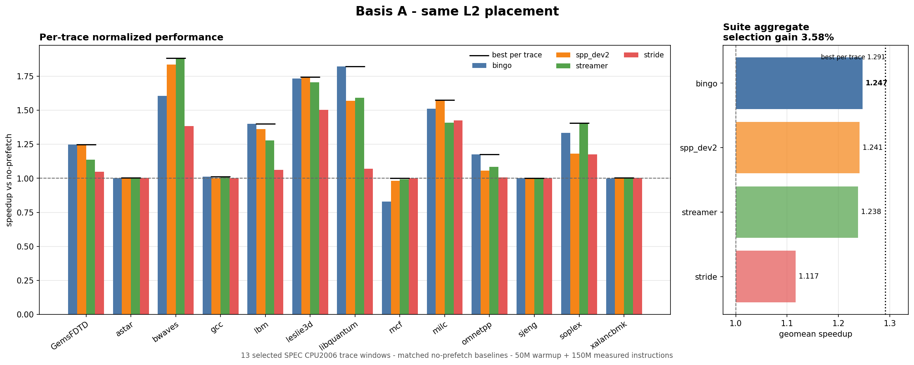

# Hardware Data Prefetcher Characterization

This repository studies how hardware data prefetcher choice and tuning vary
across different workloads. The experiments use the ChampSim-based Pythia simulator and compare five prefetchers on 13 selected SPEC CPU2006 trace windows.

The main question is simple: how much performance do we lose if we choose one
prefetcher for all traces instead of choosing the best tested prefetcher for
each trace separately?

## Experimental setup

### Prefetchers

| Prefetcher | Placement used in the main experiment |
|---|---|
| Stride | L2 |
| Streamer | L2 |
| SPP-dev2 | L2 |
| Bingo | L2 |
| IPCP | Native multilevel L1D + L2 |

Stride, Streamer, SPP-dev2, and Bingo all run at L2, so their placement is the
same. IPCP uses both L1D and L2. Its result is therefore shown separately and
should not be read as a same-cost comparison with the four L2 prefetchers.

### Traces

The study uses one selected ChampSim trace window from each of 13 SPEC CPU2006
benchmarks:

`GemsFDTD`, `astar`, `bwaves`, `gcc`, `lbm`, `leslie3d`, `libquantum`,
`mcf`, `milc`, `omnetpp`, `sjeng`, `soplex`, and `xalancbmk`.

These are SPEC CPU2006-derived traces distributed in ChampSim/DPC format. Exact filenames, download URLs, and checksums are recorded in [`config/traces.csv`](config/traces.csv).

### Simulator configuration

The saved results use this default setup:

| Component | Configuration |
|---|---|
| Processor | One 4 GHz out-of-order core |
| Pipeline width | 6-wide fetch/decode, 4-wide execute/retire |
| L1D | 32 KiB, 8-way |
| L2 | 256 KiB, 8-way |
| LLC | 2 MiB, 16-way |
| Memory | One DDR channel at 2400 MT/s |
| Warmup | 50 million instructions |
| Measurement | 150 million instructions |

The complete matrix contains 780 simulator runs. Besides the default
comparison, it covers prefetcher placement, memory-channel count, individual
prefetcher parameters.

### Reported metrics

- **Speedup** shows how performance changes relative to a matching run without
  prefetching. For example, `1.20x` means 20% higher IPC.
- **L2 demand-miss reduction** shows how much prefetching changes the number
  of L2 load and RFO misses.
- **Prefetch diagnostics** show how many prefetch requests were issued,
  filled, useful, or late, and how prefetching changed LLC read traffic.
- **Selection gain** shows how much more performance we get by choosing the
  best tested option for each trace instead of using one option for all
  traces.

Exact formulas and an explanation of how values from different traces are
combined are in
[`docs/METRICS.md`](docs/METRICS.md).

## Main findings

Different traces prefer different prefetchers. However, choosing one good
prefetcher for all 13 traces performs almost as well as choosing the best
tested prefetcher for each trace separately.

The results use two comparison groups:

- **Basis A** compares Stride, Streamer, SPP-dev2, and Bingo with all four
  prefetchers placed at L2.
- **Basis B** compares the original implementations: the four Basis-A
  prefetchers at L2 plus IPCP using both L1D and L2.

| Comparison | Best option for all traces | Result with one option | Result with best per trace | Extra gain |
|---|---|---:|---:|---:|
| Basis A: same L2 placement | Bingo | 1.2468x | 1.2914x | 3.58% |
| Basis B: original implementations | IPCP | 1.3262x | 1.3375x | 0.85% |
| Stride degree | Degree 8 | 1.2182x | 1.2312x | 1.07% |
| Streamer degree | Default degree 5 | 1.2382x | 1.2630x | 2.00% |
| SPP prefetch/fill grid | pf20/fill50 | 1.2858x | 1.2886x | 0.22% |



The main observations are:

- The best prefetcher changes from trace to trace.
- Among the four L2 prefetchers, Bingo is the best single choice for all
  traces.
- When the original implementations are compared, IPCP is the best single
  choice for all traces.
- In 7 of 13 Basis-A traces, the winner is less than 1% ahead of second place.
- Changing prefetch degree or thresholds can have a large effect on one
  trace. On average across all traces, however, choosing a separate setting
  for every trace adds only a small improvement over one good fixed setting.

The [Basis-B figure](results/analysis/selection_gain_basis_B.png) includes IPCP
using both L1D and L2. Detailed numerical results are in
[`docs/FINDINGS.md`](docs/FINDINGS.md).

## Experiment stages

### Phase 1 - Fixed architecture

The main comparison used the same processor, caches, replacement policy,
queues, warmup, and simulation length in every run. Runs being compared used
the same random seed for the same trace. The number of memory channels and the
LLC size changed only in the phases that study those two settings.

| Component | Fixed default configuration |
|---|---|
| Core | One out-of-order core at 4 GHz |
| Fetch / decode width | 6 / 6 instructions per cycle |
| Execute / retire width | 4 / 4 instructions per cycle |
| ROB / load queue / store queue | 256 / 72 / 56 entries |
| L1D | 32 KiB, 8-way, 4-cycle latency |
| L2 | 256 KiB, 8-way, 10-cycle latency |
| LLC | 2 MiB, 16-way, 20-cycle latency |
| DRAM | One channel, 2400 MT/s, 8 banks |
| Warmup / measured region | 50M / 150M instructions |


### Phase 2 - Runs without prefetching

A run without prefetching was collected for each trace. These runs provide the
reference values used in later comparisons.

| Trace | No-prefetch IPC | L2 demand MPKI |
|---|---:|---:|
| GemsFDTD | 0.45228 | 11.1586 |
| astar | 0.53061 | 1.7330 |
| bwaves | 0.60932 | 18.3547 |
| gcc | 1.37508 | 49.7258 |
| lbm | 0.48462 | 28.6538 |
| leslie3d | 0.57944 | 9.4897 |
| libquantum | 0.51376 | 26.0182 |
| mcf | 0.08243 | 95.1805 |
| milc | 0.41879 | 18.1765 |
| omnetpp | 0.25013 | 21.9404 |
| sjeng | 0.52474 | 0.4153 |
| soplex | 0.27750 | 42.5909 |
| xalancbmk | 0.58077 | 3.1523 |

The no-prefetch results range from 0.4153 L2 demand misses per thousand
instructions for `sjeng` to 95.1805 for `mcf`. This means that the selected
traces put very different amounts of pressure on memory. Separate reference
runs were also collected for two memory channels and for 1 MiB and 4 MiB
LLCs.

For a fair comparison, a prefetcher run is always compared with a no-prefetch
run that has the same channel count and LLC size. Otherwise, the result would
mix the effect of the prefetcher with the effect of changing the hardware.

### Phase 3 - Default prefetcher comparison

This stage ran five prefetchers plus no-prefetch on all 13 traces:

```text
13 traces x 6 configurations = 78 runs
```

| Prefetcher | Placement | Geometric-mean speedup | Basis-A wins | Basis-B wins |
|---|---|---:|---:|---:|
| IPCP | Native L1D + L2 | 1.3262x | - | 8 |
| Bingo | L2 | 1.2468x | 6 | 4 |
| SPP-dev2 | L2 | 1.2408x | 3 | 0 |
| Streamer | L2 | 1.2382x | 3 | 1 |
| Stride | L2 | 1.1168x | 1 | 0 |

Basis A contains the four prefetchers that run at L2. Basis B adds IPCP using
both L1D and L2.

The best prefetcher changed from trace to trace. In the common-L2 comparison,
Bingo won 6 traces, SPP-dev2 won 3, Streamer won 3, and Stride won 1. In 7 of
the 13 traces, first and second place differed by less than 1%, so several of
these wins were very close.

If one L2 prefetcher must be used for all traces, Bingo is the best tested
choice, with a geometric-mean speedup of 1.2468x. Allowing a different
prefetcher for every trace increases this result to 1.2914x, only 3.58% more.

### Phase 4 - Placement and comparison bases

This stage tested IPCP at L1D only and L2 only, plus Stride at L1D, across all
13 traces:

```text
13 traces x 3 placement variants = 39 runs
```

| Configuration | Geometric-mean speedup |
|---|---:|
| IPCP at L1D + L2 | 1.3262x |
| IPCP at L1D only | 1.3026x |
| IPCP at L2 only | 1.0000x |
| Stride at L1D | 1.1276x |
| Stride at L2 | 1.1168x |

The IPCP L2 component did almost no useful work on its own because it needs
classification information from the L1 component. The results are therefore
shown in two groups:

- **Basis A - same L2 placement:** Stride, Streamer, SPP-dev2, and Bingo.
- **Basis B - original implementations:** Basis A plus IPCP using both L1D and
  L2.

Basis A puts all four prefetchers at L2, but it does not make them equal in
size, hardware cost, or generated traffic. Basis B compares each released
implementation in its intended placement. If one Basis-B option must be used
for every trace, IPCP is best at 1.3262x. Choosing separately for each trace
reaches 1.3375x, only 0.85% more.

### Phase 5 - Effect of memory-channel count

The six default/no-prefetch configurations were rerun with two DRAM channels:

```text
13 traces x 6 configurations = 78 runs
```

| Prefetcher | Average change when moving from 2 channels to 1 |
|---|---:|
| Bingo | -4.3% |
| IPCP | -2.4% |
| Streamer | -2.2% |
| SPP-dev2 | -1.7% |
| Stride | -0.7% |

A negative value means that the prefetcher lost some of its advantage when
the system moved from two channels to one.

For each channel count, the prefetcher was compared with a no-prefetch run
using the same number of channels. Moving from two channels to one reduced
Bingo's average benefit the most and Stride's the least.

This does not tell us how much bandwidth each prefetcher uses. Changing the
channel count also changes how many memory requests can run in parallel, how
they wait in queues, and how addresses map to memory.

### Phase 6 - Sensitivity screening

This phase was the broad screening step. Six parameters were changed one at a
time while every other parameter stayed at its default value. The goal was to
find which parameters mattered enough to study more closely, not to find the
best combination of parameters.

The screening produced 260 runs. For each parameter, the table shows the
difference between its best and worst tested speedup. The difference is shown
in percentage points.

| Prefetcher | Parameter | Tested values, including default | Average best-to-worst difference | Largest difference |
|---|---|---|---:|---:|
| Stride | Prefetch degree | 1, **2**, 4, 8, 16 | 27.3 pp | 91.0 pp |
| Streamer | Prefetch degree | 1, 2, 4, **5**, 16 | 17.9 pp | 70.8 pp |
| SPP-dev2 | Fill threshold | 50, 70, **90**, 100 | 17.2 pp | 67.0 pp |
| SPP-dev2 | Prefetch threshold | 20, **40**, 60, 80 | 16.1 pp | 44.8 pp |
| Bingo | PHT entries | 1024, 2048, **4096**, 8192 | 2.4 pp | 9.1 pp |
| Bingo | L2 threshold | 0.50, 0.65, **0.80**, 0.95 | 0.9 pp | 4.7 pp |

Bold values are the measured defaults.

Stride degree, Streamer degree, and both SPP thresholds made a large
difference on some traces. Changing Bingo's L2 threshold made little
difference. Changing the number of Bingo PHT entries had a small but visible
effect.

A larger or more aggressive setting was not always better. It could help one
trace and hurt another. The screening showed that Stride degree, Streamer
degree, and both SPP thresholds were the most important tuning candidates.

### Phase 7 - Follow-up tuning after the sensitivity sweep

This phase used the Phase-6 results in two ways:

1. The existing Stride and Streamer degree results were reused to compare one
   degree for all traces with the best tested degree for each trace.
2. Because both SPP thresholds were sensitive in Phase 6, 13 combinations of
   prefetch and fill thresholds were tested together on every trace.

Only the second step required new simulations:

```text
13 traces x 13 SPP configurations = 169 runs
```

No additional Bingo tuning grid was run because its tested parameters changed
the results much less during the sensitivity screening.

| Tuning space | Best setting for all traces | Result with one setting | Result with best per trace | Extra gain |
|---|---|---:|---:|---:|
| Stride degree | 8 | 1.2182x | 1.2312x | 1.07% |
| Streamer degree | Default 5 | 1.2382x | 1.2630x | 2.00% |
| SPP prefetch/fill grid | pf20/fill50 | 1.2858x | 1.2886x | 0.22% |

Some traces preferred very different settings. Even so, choosing a separate
setting for each trace improved the geometric mean by only 0.22% to 2.00%,
depending on the parameter being tuned.

### Phase 8 - Effect of LLC size

The default/no-prefetch configurations were rerun with 1 MiB and 4 MiB LLCs:

```text
2 LLC variants x 13 traces x 6 configurations = 156 runs
```

| Prefetcher | 1 MiB LLC | 2 MiB LLC | 4 MiB LLC | Average trend |
|---|---:|---:|---:|---|
| Stride | 1.1186x | 1.1168x | 1.1142x | Slightly smaller benefit |
| Streamer | 1.2405x | 1.2382x | 1.2352x | Slightly smaller benefit |
| SPP-dev2 | 1.2478x | 1.2408x | 1.2227x | Smaller benefit |
| Bingo | 1.2370x | 1.2468x | 1.2572x | Larger benefit |
| IPCP | 1.3231x | 1.3262x | 1.3306x | Slightly larger benefit |

At each LLC size, the prefetcher was compared with a no-prefetch run using the
same LLC size. As the LLC grew, the average benefit became slightly smaller
for Stride, Streamer, and SPP-dev2, and slightly larger for Bingo and IPCP.

Without prefetching, only `mcf` and `soplex` changed by more than 10% between
the 1 MiB and 4 MiB LLCs. The results show that LLC size affects prefetcher
performance, but the available counters cannot tell us whether cache
pollution caused the change.

## What this study did not cover

- Only one trace window was used for each benchmark, so the results do not
  represent complete program executions.
- The study did not test multiple cores or competition for a shared cache.
- The prefetchers were not made equal in storage, hardware area, lookup cost,
  queue use, or generated traffic.
- Changing the number of memory channels does not directly measure bandwidth
  use.

The conclusions apply only to these selected single-core trace windows. They
do not establish a universal ranking for SPEC or for programs in general.

## Build and run

There are three separate workflows: a quick local check, the complete Slurm
experiment, and analysis of existing simulator outputs.

### 1. Build the simulator and run a quick check

Requirements: Linux, Git, CMake, Make, Perl, curl, a C/C++ toolchain, Bash,
and Python 3.8 or newer.

Run these commands from the repository root:

```bash
# Build Pythia, libbf, and the four simulator variants.
./setup/bootstrap_pythia.sh

# Download and verify the 13 traces in config/traces.csv.
./setup/fetch_traces.sh

# Run a short one-trace check without Slurm.
./scripts/run_debug.sh
```

The last command checks that the simulator and parser work together. Its short
results are written to `results/debug/` and are not part of the study.

### 2. Run the complete experiment

The full 780-run experiment requires Slurm. Install the plotting dependencies
in the Python environment available to the analysis node:

```bash
python3 -m pip install -r requirements.txt
```

Then set the cluster-specific values and start the driver:

```bash
PARTITION=your-partition \
JOB_MEMORY=4G \
ARRAY_LIMIT=32 \
PYTHON=python3 \
  ./scripts/run_all.sh
```

The driver verifies the binaries and traces, creates all job lists, records
the run environment, submits the seven simulation arrays, and submits the
analysis job after all simulations finish successfully.

- Raw simulator outputs are written to `results/slurm/`.
- CSV files, text summaries, and plots are written to `results/analysis/`.
- Run provenance is written to `results/analysis/provenance.txt`.

### 3. Analyze existing outputs

If `results/slurm/` already contains all 780 `.out` files, install the plotting
dependencies and rerun the analysis:

```bash
python3 -m pip install -r requirements.txt
PYTHON=python3 ./scripts/analyze.sh
```

To generate CSV and text reports without Matplotlib or NumPy:

```bash
ANALYZE_PLOTS=0 PYTHON=python3 ./scripts/analyze.sh
```

Exact job counts, optional settings, output locations, and verification steps
are documented in [`docs/BUILD.md`](docs/BUILD.md).

## References

- [Pythia - MICRO 2021](https://doi.org/10.1145/3466752.3480114)
- [IPCP - ISCA 2020](https://doi.org/10.1109/ISCA45697.2020.00021)
- [Bingo - HPCA 2019](https://doi.org/10.1109/HPCA.2019.00053)
- [Third Data Prefetching Championship](https://dpc3.compas.cs.stonybrook.edu/)
- [ChampSim](https://github.com/ChampSim/ChampSim)

## License

The original code and documentation in this repository are available under
the [MIT License](LICENSE).

Pythia, ChampSim, libbf, benchmark traces, and referenced papers are not
covered by this license. They remain subject to their own licenses and
distribution terms.
